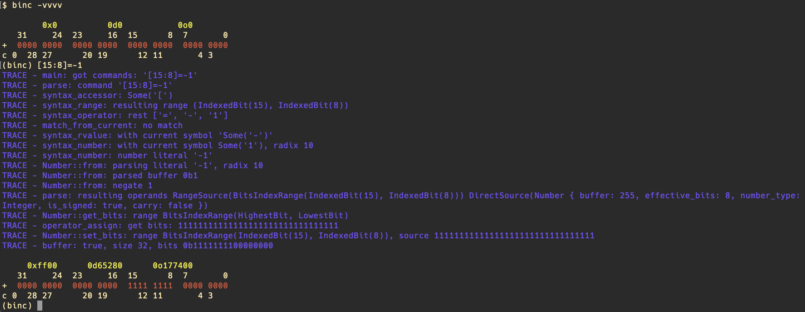

# binc

  
binc is a command line interface BINary Calculator.

It prints *the number* in binary format and reads commands from standard input to be executed upon *the number* or particular bits of *the number*.

There is binc's output with 42 assigned to *the number*.
```text
$ binc                                           | shell's command line
                                                 |
        0x2a         0d42          0o52          | number representation in different radixes
   31     24  23     16  15      8  7       0    | bit indexes
+  0000 0000  0000 0000  0000 0000  0010 1010    | the number in binary radix
c 0  28 27      20 19      12 11       4 3       | bit indexes
(binc)                                           | binc's prompt
```

"bit indexes" intended to help user to understand what index each bit has. "*the number* in binary radix" is split up into a bytes and half-bytes 0/1 sequences.

On the line called "*the number* in binary radix" there is a '+' on the left, it represents that the number is positive, '-' for negative number.

The 'c 0' under the '+' means carry, it as a state of "carry bit", whether the overflow occurred after operation or not.

## Usage
Command syntax is:  
 - X operator Y
 - operator X
 - command

, where *X* is lvalue, a **range** only; *Y* is rvalue operand, a **number** or **range**; *operator* is some math operation, like `>>` or `+`; *command* is literal command.
Spaces are ignored like in Fortran ☺️  
**number** is a numeric literal with prefixes 0x, 0d, 0b, 0h(0x) to specify corresponding radix. Can be prefixed with minus to make it negative.  
First operand *X* may be omitted, by default it is range `[]` - *the whole number*, `[i:j]` - bits from `j` to `i`, j <= i. If *operator* is omitted than binc do assignment operation by default. Only *Y* operand is necessary. If one typed just 123, the number 123 will be set.  
Empty command line repeats last command.

binc knows `help` command with no arguments, which will print all possible commands and operators and syntax tips for using them.

Quit binc by sending `[CTRL+C]`, `[CTRL+D]` or pressing `[CTRL+Q]`.

## Binary Operators
| operator | description | operator | description                              |
|----------|:------------|:---------|------------------------------------------|
| `=`      | assignment  | `==`     | comparison, only prints result           |
| `+`      | add         | `>>`     | signed shift right, 1000 >> 1 is 1100    |
| `-`      | subtract    | `>>>`    | unsigned shift right (1000 >>> 1 == 0100 |
| `*`      | multiply    | `<<`     | shift left                               |
| `/`      | divide      | `>`      | greater, only prints result              |
| `%`      | remainder   | `<`      | less, only prints result                 |
| `^`      | bitwise xor | `~>>`    | signed cyclic shift right                |
| `&`      | bitwise and | `<<~`    | cyclic shift left                        |
| &#124;   | bitwise or  | `pow`    | exponentiation                           |
| `<>`     | exchange    | `root`   |                                          |

## Unary operators
| operator | description  | operator | description         |
|----------|:-------------|:---------|---------------------|
| `~`      | bitwise not  | `!`      | arithmetic negation |
| `shf`    | shuffle bits | `rnd`    | randomize           |
| `rev`    | reverse      |          |                     |

## Commands
| command    | action                                                               |
|------------|:---------------------------------------------------------------------|
| `help`     | prints all operators, commands and syntactic tips                    |
| `undo`     | undo last operation                                                  |
| `reduo`    | redo operation, that was "undo"ed                                    |
| `intX`     | treat *the number* as an integer, X - bits: 8, 16, 32, 64, 128, 256. |
| `floatX`   | treat *the number* as a floating point one, X - bits.                |
| `fixedX`   | treat *the number* as a fixed point one, X = bits.                   |
| `printf`   | prints *the number* in a specified format.                           |
| `signed`   | treat *the number* as singed int (bit width does not change).        |
| `unsigned` | treat *the number* as unsinged int (bit width does not change) .     |

## Examples
`(binc) 42` sets *the number* to 42.  
`(binc) +1` add 1 to *the number*.  
`(binc) /2>>1` divides *the number* by 2 and shifts right one bit.  
`(binc) [31]=1` set 31-st bit of *the number* to 1, the number becomes negative.  
`(binc) [31:24] cnt 0` count zero bits in range from 24-th bit to 31-st bit inclusive.  
`(binc) [15:4] printf x` prints bits from 4 to 15 inclusive as hexadecimal (not ready).

## Miscellaneous
- binc is colored

- It is possible to make binc to print logs by passing flag -v to command line.  
- Set history size by passing --history=X, where X is a history length.
- binc's command line supports multiple commands in one line, separated by `;`.